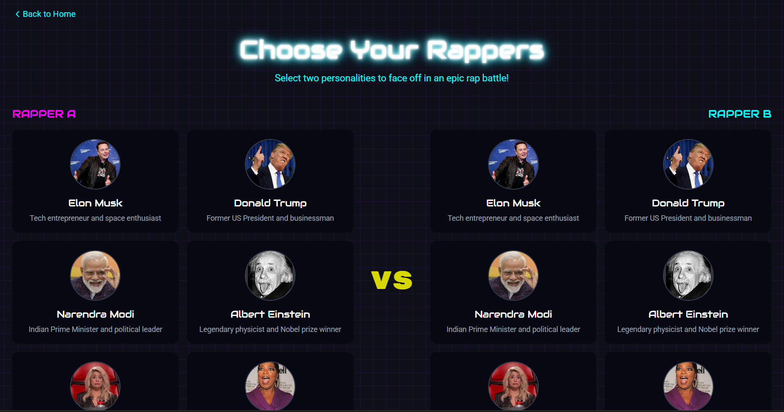
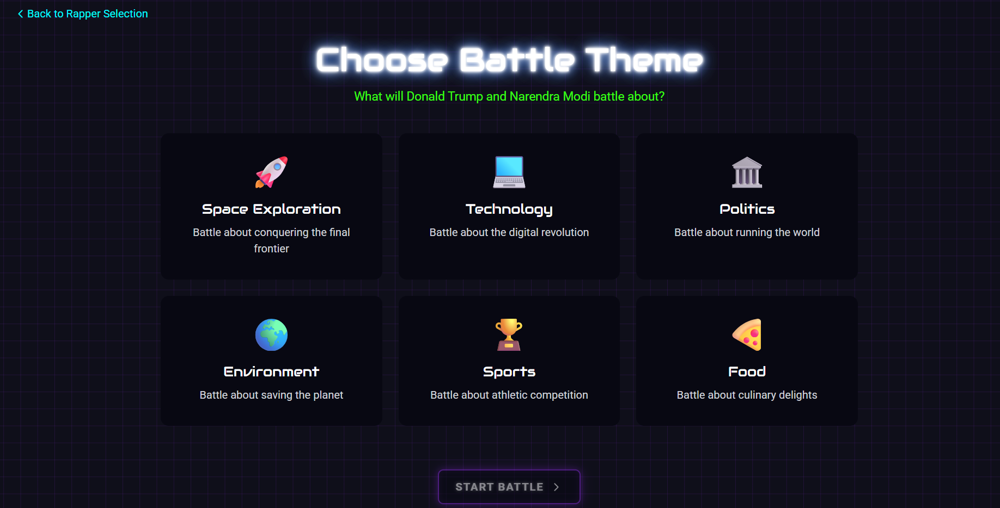
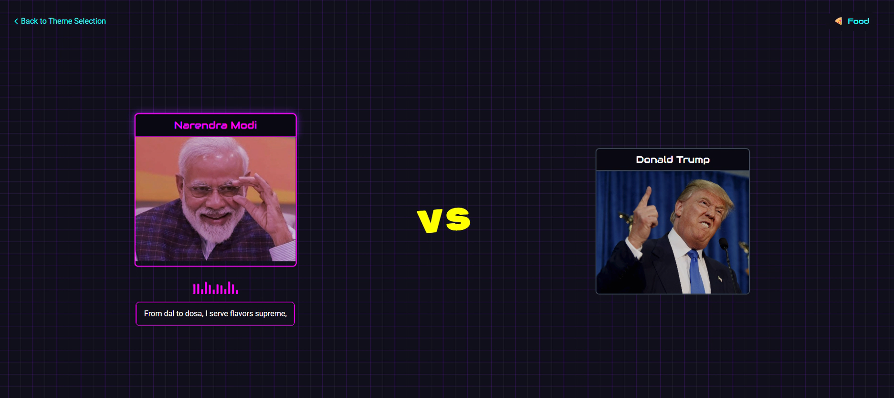
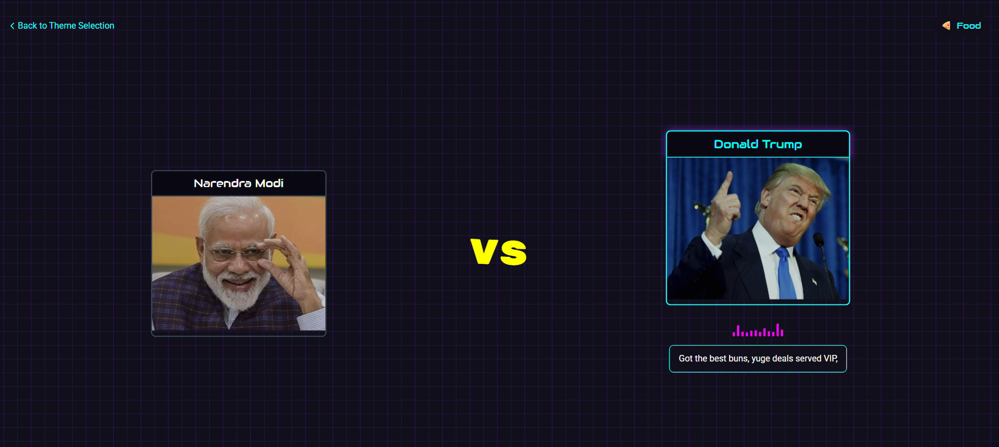
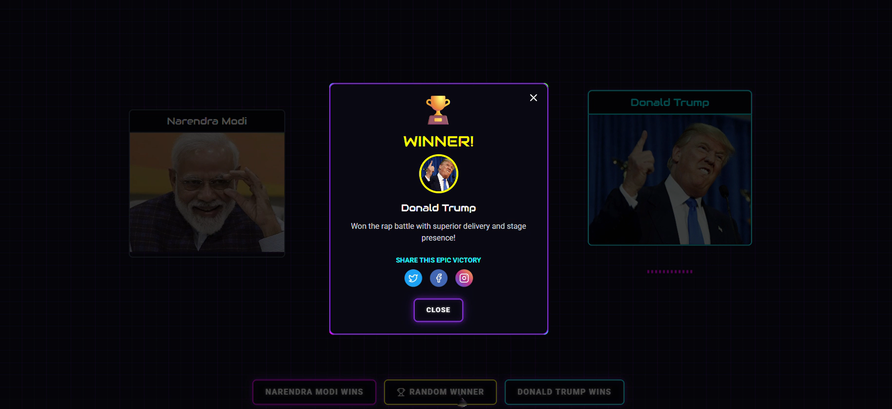

# 🎤 RapBot Royale 

RapBot Royale is a dynamic AI-powered rap battle web app. Choose your rapper persona, select a theme, and watch them drop custom-generated rap performed live using voice synthesis! Built with React, Node.js, and ElevenLabs' streaming TTS.

---

## 🔗 Deployed Link

- 🌐 [Live Demo](https://rapbot-royale.onrender.com)
- 💻 [Backend Deployed Link](https://rapbot-royale-production.up.railway.app/)

---

## 📸 Snapshots

  

  

  

  

  

  

---

## ✨ Features

- 🎭 Select from a roster of AI rapper personas  
- 🎯 Choose themed rap battle topics  
- 🎤 Real-time rap lyric generation via GPT-4.1-mini  
- 🔊 Live voice synthesis using ElevenLabs Text-To-Speech (streamed audio)  
- ⚛️ Built with React frontend and Node.js backend  
- 🚀 Serverless functions for dynamic generation and TTS  

---

## 🚀 Getting Started

### 📋 Prerequisites

- **Node.js** ≥ 16 (latest LTS recommended)
- **Frontend .env file:**
  - `VITE_BACKEND_URL` – `http://localhost:${port_number}` 
- **Backend .env file:**
  - `ELEVENLABS_API_KEY` – for real-time text-to-speech  
  - `GITHUB_TOKEN` – *(used for GitHub-based AI services)*  

---

### 📦 Installation

```bash
git clone https://github.com/rahul-2004-json/RapBot-Royale.git
cd RapBot-Royale
```
---
### ▶️ Running Locally
- **🖥 Start Backend**
```bash
cd server/
npm install
node index.js
```
- **🌐 Start Frontend (in a separate terminal)**
```bash
cd client/
npm install
npm run dev
```
---
## ⚠️Important Notes
- This app requires private API keys to work properly (GitHub AI Inference (gpt-4.1-mini) & ElevenLabs Text to Speech API).
- You must obtain your own API keys by signing up on the respective platforms and set them in a .env file as stated above.
- For easy deployment ,I recommend using Railway for backend, and Render for frontend.
- No API keys are stored in this repo for security reasons.


